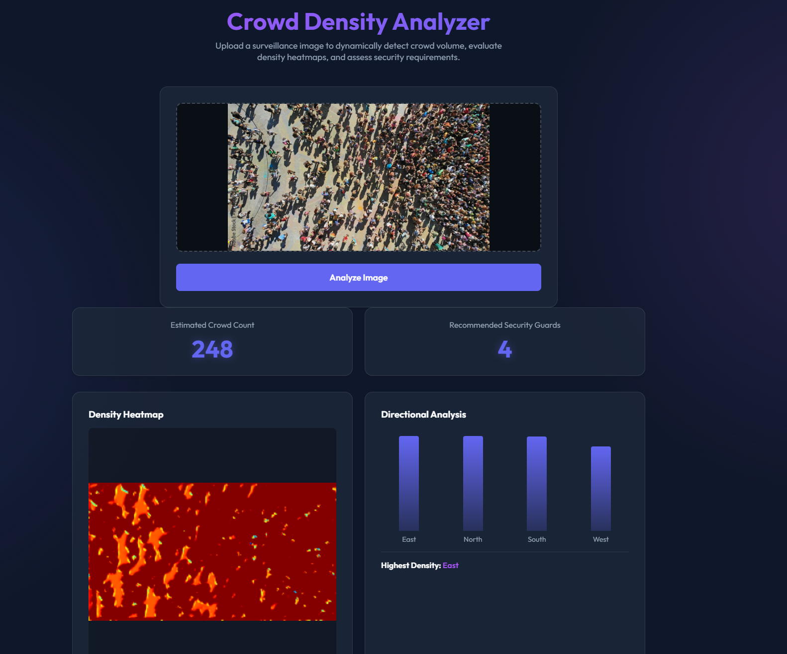

# Crowd Density Analysis System


A modern, highly accurate machine learning system designed to dynamically evaluate crowd density from surveillance images, perform directional analysis, and recommend security resource allocations in real-time.



---

## 📖 Detailed Explanation

Managing security and safety in highly populated areas (concerts, stadiums, transport hubs) relies on an accurate head-count and spatial awareness. Manual counting is impossible, and generic visual AI struggles with highly obscured crowd elements. 

This **Crowd Density Analysis System** solves this by leveraging a custom Convolutional Neural Network (MC-CNN), heavily optimized to count contiguous crowd blobs, map them spatially to a heat matrix, and assess density vectors. The seamless separation of concerns between our lightning-fast TypeScript UI and horizontally scalable Dockerized Python backend ensures high responsiveness even under massive observation loads.

---

## 🏗 System Architecture

The project employs a robust microservice-based architecture:


### 1. The PyTorch ML Engine (Backend/Model)
At its core, the project uses a highly tuned **Multi-Column Convolutional Neural Network (MC-CNN)**. It accepts preprocessed image tensors, splits visual parsing across varying receptor field columns to handle both near and distant faces flawlessly, and merges them through a 1x1 fusion layer to yield a highly accurate pixel-wise density map.

### 2. The Python Backend API
The ML engine is wrapped tightly in a Flask/Gunicorn API endpoint. The REST microservice accepts standard image binaries via `POST /predict`. To ensure lightning-fast computational times, it pre-processes images, calculates the matrix boundaries on the density prediction, computes relative directional clustering (North/South/West/East), and base64 encodes the resultant heatmap back to the frontend.

### 3. The Typescript Frontend
Built defensively with Vanilla TypeScript and Vite, our lightning-fast UI is free from bloat. It provides operators a drag-and-drop dashboard to interact dynamically with the ML engine. State changes calculate instantly utilizing hardware-accelerated CSS animations and custom JS math easing for numerical changes. Built with glassmorphism style components and responsive flexing, the frontend guarantees maximum readability of the security recommendations across any device.

### 4. Containerization via Docker
The Backend is securely bundled in a lightweight `python:3.9-slim` multi-layer Dockerfile. With all OS-level dependency bloat (like `libgl1` required for OpenCV execution) natively handled, the backend operates entirely plug-and-play across environments without system contamination.

---

## 🚀 How to Run Locally

### 1. Backend Service (Dockerized)
The backend runs as a containerized microservice exposing the `/predict` API.

Ensure the `crowd_counting.pth` model file is located properly inside your `/backend` directory before building!

```bash
# Build the Docker image
docker build -t crowd-backend .

# Run the backend
docker run -p 8000:8000 crowd-backend
```
*(If running natively without docker, simply install the `backend/requirements.txt` via `pip` and execute `python backend/app.py` instead.)*

### 2. Frontend Application
The front end provides a beautiful interface. We use `npm` and Vite for rapid development tracking.

```bash
cd frontend
npm install
npm run dev
```

Navigate to `http://localhost:3000` to utilize the dashboard.
